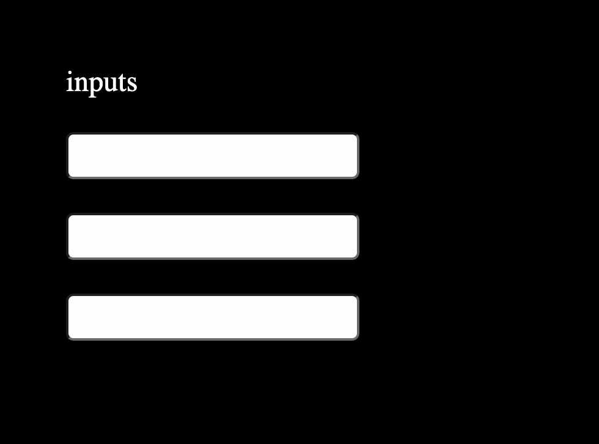
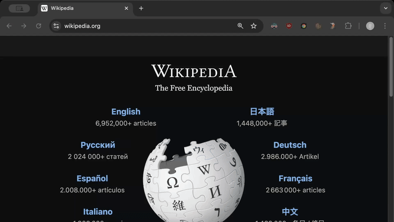
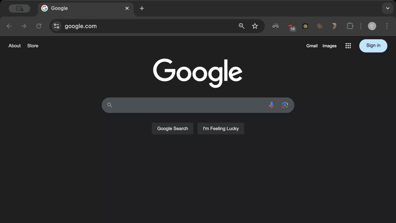
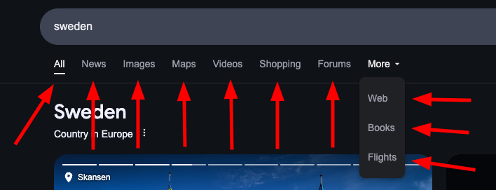
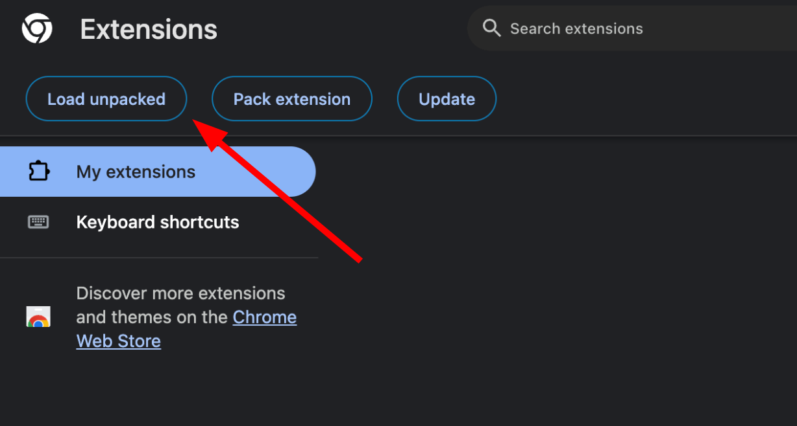

<h1 align='center'>
  
</h1>


## 🌋 The Mouse is Lava

The Mouse is Lava (MIL) is a [Chrome
extension](https://chromewebstore.google.com/detail/The%20Mouse%20is%20Lava/pahaiknnkdphjllfldognhanpfblfbig)
that adds keyboard shortcuts to navigate websites with your keyboard.
The goal of the extension is to minimize the number of times you have to
touch the mouse. Don't touch that mouse; it's lava.

MIL includes both shortcuts that work on every website and shortcuts for
specific, popular websites. Like Google.

Do you have an idea for a useful keyboard shortcut not yet included in
MIL? Please open an issue or a PR! 🙌 PRs always welcome.

MIL is currently in beta. But it works; I use it all day every day.
Quickstart guide:

  - Install MIL from the [Chrome Store](https://chromewebstore.google.com/detail/The%20Mouse%20is%20Lava/pahaiknnkdphjllfldognhanpfblfbig).
  - `Ctrl+B` to focus the first, or next, `<input>` element on the page.
  - `Ctrl+I` to find links in the page. It's like `Ctrl-F` but only
    finds links. Then `[enter]` to click them.
  - On Google search results pages, `[j]`+`[k]` and
    `[downArrow]`+`[upArrow]` select the next, and previous, Google
    search results respectively. Then `[enter]` to click them.

All keyboard shortcuts are customizable in
[chrome://extensions/shortcuts](chrome://extensions/shortcuts).


### Universal Shortcuts That Work on Every Site


#### Ctrl+B - Focus The First Visible Input Element

`Ctrl+B` - Focus the first, or next, visible, interactable, and
not-disabled `<input>` element in the visible page. I.e. the first
interactable `<input type="text">` element. `<textarea>` elements aren't
supported yet, but will be.

The first press of `Ctrl+B` focuses the first input element in the
visible page. Subsequent presses of `Ctrl+B` iteratively focus
successive `<input>` elements in the visible page.

<p>
  
</p>

You can change the default `Ctrl+B` keybind that focuses the first input
element in
[chrome://extensions/shortcuts](chrome://extensions/shortcuts).


#### Ctrl+I - Find Links and Click Them

`Ctrl+I` - Opens the link search box to find clickable links in the
visible page that contain your search query text. Think of the link
search box like Chrome's `Ctrl+F` Find-in-Page tool except it only finds
clickable links. Why? It's much faster to type a few characters of the
link you want to click than to move your hand to the mouse, move the
mouse to the link, click, and move your hand back.

When the `Ctrl+I` link search box is open, these additional keybinds
become active:

- `Ctrl+J` and `Ctrl+K` - Jump to the next and previous link,
  respectively. (VIM style keybinds)
- `Tab` and `Shift+Tab` - Jump to the next and previous link,
  respectively.
- `Enter` - Click the currently selected link. E.g. open the selected
  link in the same tab.
- `Ctrl+Enter` - Control+click the currently selected link. E.g. open
  the selected link in a new tab.

<p>
  
</p>

You can change the default `Ctrl+I` keybind that opens the link search
box in [chrome://extensions/shortcuts](chrome://extensions/shortcuts).


### Google.com Shortcuts

#### Google Search Shortcuts

MIL adds keyboard shortcuts to navigate Google search results. While on
google.com search pages, these keyboard shortcuts become active:

- `j` and `k` - Jump to the next and previous search result,
  respectively. (VIM style keybinds)
- `[downArrow]` and `[upArrow]` - Jump to the next and previous search
  result, respectively.
- `[enter]` - Navigate to the selected search result.
- `Ctrl+Enter` - Load the selected search result in a new tab.

By default, the first Google search result is automatically selected on
page load so you can just press `[enter]`, or `Ctrl+Enter`, to navigate
to the first result.

<p>
  
</p>


#### Google Navbar Shortcuts

MIL adds keyboard shortcuts to navigate between the different category
tabs. While on a Google.com search results page, these keyboard
shortcuts become available to navigate:

- `a` - Load the `All` category tab.
- `n` - Load the `News` category tab.
- `i` - Load the `Images` category tab.
- `v` - Load the `Videos` category tab.
- `s` - Load the `Shopping` category tab.
- `f` - Load the `Forums` category tab.
- `w` - Load the `Web` category tab.
- `m` - Load the `Maps` category tab.
- `b` - Load the `Books` category tab.
- `l` - Load the `Flights` category tab.

<p>
  
</p>


### Development

To develop MIL locally, first check out this repository

```
git clone https://github.com/gruns/the-mouse-is-lava
```

and then load the extension unpacked on
[chrome://extensions/](chrome://extensions/).

<p>
  
</p>


### Known Improvements. PRs welcome! 🙌

- Add support for `Ctrl+B` to focus `<textarea>` elements, too. Not just
  `<input>` elements.

- Automatically click Google AI snippets `Show more` once the AI result
  is ready. Add this as an toggleable feature.

- Support finding buttons with matching text with the link finder
  box. E.g. `<input type='button'>text to match</input>`.